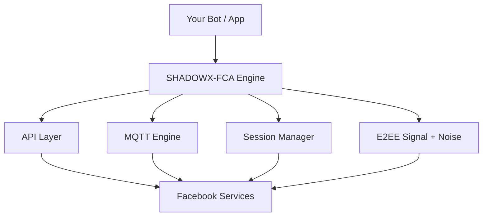

<div align="center">


```console
SHADOWX-FCA v10.8.0 ── Facebook Messenger API Engine for Node.js
🛠️  Forked & rebranded by MUEID MURSALIN RIFAT
🟢  status: online   ⚡ engine: Signal + Noise WebSocket   🔒 E2EE: active
```

**A fast, secure, and feature-rich unofficial Facebook Messenger API client — the engine that powers SHADOWX-BOT.**

> *"Not coded to impress, coded to express."*

<br>

<a href="https://github.com/mueidmursalinrifat/shadowx-fca"></a>
<a href="https://github.com/mueidmursalinrifat/shadowx-fca"></a>
<a href="https://github.com/mueidmursalinrifat/shadowx-fca/blob/main/LICENSE"></a>


🌐 [Portfolio](https://mueidmursalinrifat.onrender.com) • 📘 [Facebook](https://www.facebook.com/mueid.mursalin.rifat1) • 📦 [Repository](https://github.com/mueidmursalinrifat/shadowx-fca)

</div>

---

## 📑 Contents

```console
root@shadowx:~$ ./shadowx-fca --help
[ OK ] loading table of contents...
```

- 🧭 [About](#-about)
- ⭐ [Highlights](#-highlights)
- ✨ [Features](#-features)
- 🔐 [E2EE](#-e2ee)
- 🚀 [Quick Start](#-quick-start)
- 💬 [Messaging](#-messaging)
- 👥 [Thread Management](#-thread-management)
- 👤 [User Operations](#-user-operations)
- 🖼️ [Profile Management](#-profile-management)
- 😍 [Reactions & Interactions](#-reactions--interactions)
- 🔧 [Message Actions](#-message-actions)
- 📡 [Mass Broadcasting](#-mass-broadcasting)
- 🌐 [HTTP Utilities](#-http-utilities)
- 🔑 [Login Methods](#-login-methods)
- ⚙️ [Configuration](#-configuration)
- 🏗️ [Architecture](#-architecture)
- 🛡️ [Best Practices](#-best-practices)
- 📋 [Requirements](#-requirements)
- 🤝 [Contributing](#-contributing)
- 🌟 [Connect](#-connect)
- 🎨 [Identity](#-identity)

---

## 🧭 About

```console
root@shadowx:~$ ./shadowx-fca --describe
[ OK ] engine       : shadowx-fca
[ OK ] protocol     : mqtt + noise websocket
[ OK ] encryption   : signal protocol (E2EE)
[ OK ] api methods  : 90+ mounted
[ OK ] boot complete: ready to serve
```

SHADOWX-FCA is a modern Facebook Messenger API client for Node.js, built for bots, automation systems, integrations, and advanced Messenger applications. It is the engine that drives **SHADOWX-BOT**.

Four ideas guide the build.

| Goal | Meaning |
|---|---|
| ⚡ Speed | Optimized MQTT communication and event handling for real-time messaging. |
| 🔒 Security | Signal Protocol E2EE, session protection, and automatic appState backups. |
| 🛡️ Stability | Auto-healing architecture with automatic reconnection and recovery. |
| 🧩 Flexibility | 90+ API methods covering messages, threads, users, and profiles. |

The result is a complete toolkit for anything you want to build on Messenger.

---

## ⭐ Highlights

```console
root@shadowx:~$ ./shadowx-fca --highlights
[1/8] 🎨 identity and banner rebuilt
[2/8] 🔒 signal protocol E2EE armed
[3/8] 📡 noise websocket online
[4/8] 🚀 90+ api methods loaded
[5/8] 💾 auto session backup armed
[6/8] 🛡️ auto-healing reconnect armed
[7/8] 🌐 http utilities attached
[8/8] 🟢 node 18+ runtime locked
[ OK ] all systems nominal
```

- 🎨 Rebuilt identity, banner, and documentation
- 🔒 Native Signal Protocol E2EE — no external npm package needed
- 📡 Noise WebSocket handshake (`Noise_XX_25519_AESGCM_SHA256`)
- 🚀 90+ powerful API methods and utilities
- 💾 Automatic appState protection with backup rotation
- 🛡️ Auto-healing recovery from connection problems
- 🌐 Built-in HTTP GET/POST/form-data helpers
- 🟢 Node.js 18+ with modern crypto built in

---

## ✨ Features

```console
root@shadowx:~$ ./shadowx-fca --features
[ OK ] scanning feature set...
[ OK ] 9 groups loaded
[ OK ] messaging, threads, users, profiles ready
[ READY ] use the sections below to explore
```

| Feature | Description |
|:---:|---|
| ⚡ **Lightning Fast** | Optimized MQTT communication engine |
| 🔒 **Security First** | Session protection with automatic backups |
| 🛡️ **Auto-Healing** | Automatic recovery from connection problems |
| 🔄 **Auto Reconnect** | Automatically reconnect after disconnects |
| 🌐 **90+ Methods** | Messages, users, threads, reactions and more |
| 📡 **Real-Time Events** | Powerful MQTT event listener |
| 💾 **Auto Save** | Automatic appState protection |
| 📢 **Broadcasting** | Controlled multi-thread broadcasting |
| 👥 **Thread Tools** | Complete group management utilities |
| 👤 **User Tools** | User information and relationship APIs |

---

## 🔐 E2EE

```console
root@shadowx:~$ ./shadowx-fca --e2ee
[ OK ] device store  : .shadowx-fca/e2ee_device.json
[ OK ] registration  : ICDC device registered
[ OK ] prekeys       : 50 uploaded to server
[ OK ] handshake     : Noise_XX_25519_AESGCM_SHA256
[ OK ] ratchet       : Signal Double Ratchet active
[ OK ] listener      : mqtt + e2ee merged
```

SHADOWX-FCA ships with a **vendored, self-owned E2EE engine** — no external npm dependency.

The full protocol stack:

| Layer | Technology |
|---|---|
| 🔄 Ratchet | `@signalapp/libsignal-client` — Signal Protocol (Double Ratchet) |
| 🤝 Handshake | `Noise_XX_25519_AESGCM_SHA256` WebSocket handshake |
| 🧬 Encoding | WA-binary + Protobuf message encoding |
| 📱 Device | ICDC device registration with Facebook |
| 🔑 Keys | X25519 DH, HKDF-SHA256, AES-256-GCM, HMAC-SHA256 |

E2EE auto-connects and merges into `api.listen()` and `api.listenMqtt()`, so Secret Conversation messages arrive with zero extra setup.

```console
root@shadowx:~$ ./shadowx-fca --e2ee-trace
[1/5] 📂 device store loaded
[2/5] 📱 ICDC registration checked
[3/5] 🔑 prekeys uploaded
[4/5] 🤝 noise websocket opened
[5/5] 🔒 double ratchet armed
[ OK ] e2ee active
```

---

## 🚀 Quick Start

```console
root@shadowx:~$ ./shadowx-fca --install
[ OK ] installing shadowx-fca...
[ OK ] done
```

```bash
npm install shadowx-fca
```

```javascript
const { login } = require("shadowx-fca");
const appState = require("./account.json");

login(
  { appState },
  { listenEvents: true },
  (err, api) => {
    if (err) {
      console.error(err);
      return;
    }

    console.log("╭─────────────────────────────╮");
    console.log("│  🚀 SHADOWX-FCA CONNECTED  │");
    console.log("╰─────────────────────────────╯");

    api.autoSaveSession("./account.json", {
      interval: 3 * 60 * 1000,
      backup: true
    });

    api.listenMqtt((err, event) => {
      if (err) {
        console.error("Listen error:", err);
        return;
      }

      if (event.type === "message") {
        api.sendMessage(
          "🤖 I received: " + event.body,
          event.threadID
        );
      }
    });
  }
);
```

### 🔐 Session Protection

```javascript
api.autoSaveSession("./account.json");

api.autoSaveSession("./account.json", {
  interval: 5 * 60 * 1000,
  debounce: 30 * 1000,
  backup: true,
  maxBackups: 5
});

api.restoreFromBackup();
api.stopAutoSave();
```

---

## 💬 Messaging

### Send Message

```javascript
api.sendMessage("Hello world!", threadID);
```

### Send Attachment

```javascript
const fs = require("fs");

api.sendMessage(
  {
    body: "Check this out!",
    attachment: fs.createReadStream("./photo.jpg")
  },
  threadID
);
```

### Mentions

```javascript
api.sendMessage(
  {
    body: "Hey @John, how are you?",
    mentions: [
      {
        id: "123456789",
        tag: "@John",
        fromIndex: 4
      }
    ]
  },
  threadID
);
```

### Sticker

```javascript
api.sendMessage(
  {
    sticker: "369239263222822"
  },
  threadID
);
```

### Location

```javascript
api.sendMessage(
  {
    location: {
      latitude: 23.8103,
      longitude: 90.4125,
      current: true
    }
  },
  threadID
);
```

---

## 👥 Thread Management

```console
root@shadowx:~$ ./shadowx-fca --threads
[ OK ] createGroup, getInfo, getList ready
[ OK ] addUserToGroup, removeUserFromGroup ready
[ OK ] setTitle, changeColor, changeEmoji ready
[ OK ] changeAdminStatus, createPoll ready
```

```javascript
const info = await api.getThreadInfo(threadID);
const threads = await api.getThreadList(20);
const history = await api.getThreadHistory(threadID, 50);

const groupID = await api.createGroup("New Group", ["user1", "user2"]);

await api.addUserToGroup(userID, threadID);
await api.removeUserFromGroup(userID, threadID);

await api.setTitle("New Group Name", threadID);
await api.changeThreadColor("#0084FF", threadID);
await api.changeThreadEmoji("🔥", threadID);
await api.changeNickname("Captain", threadID, userID);
await api.changeGroupImage(fs.createReadStream("./group.png"), threadID);

await api.changeAdminStatus(threadID, userID, true);

await api.createPoll(
  "What's your favorite color?",
  threadID,
  {
    Red: false,
    Blue: false,
    Green: false
  }
);
```

---

## 👤 User Operations

```javascript
const user = await api.getUserInfo(userID);
const userV2 = await api.getUserInfoV2(userID);
const users = await api.getUserID("John Doe");
const uid = await api.getUID("https://facebook.com/username");
const friends = await api.getFriendsList();
const avatar = await api.getAvatarUser(userID);

// Relationship Management
await api.sendFriendRequest(userID);
await api.handleFriendRequest(userID, true);
await api.changeBlockedStatus(userID, true);
await api.unfriend(userID);
```

---

## 🖼️ Profile Management

```javascript
await api.changeAvatar(fs.createReadStream("./avatar.jpg"));
await api.changeCover(fs.createReadStream("./cover.jpg"));
await api.changeBio("Powered by SHADOWX-FCA");
```

---

## 😍 Reactions & Interactions

```javascript
await api.setMessageReaction("❤️", messageID, threadID);
await api.setMessageReaction("", messageID); // Remove reaction
await api.reactToPost(postID, "😂");

await api.sendMessage("Nice message!", threadID, null, messageID); // Reply
```

---

## 🔧 Message Actions

```javascript
await api.editMessage("Updated text", messageID);
await api.unsendMessage(messageID);
await api.deleteMessage([messageID1, messageID2]);
await api.forwardAttachment(attachmentID, [userID]);

const attachments = await api.uploadAttachment([
  fs.createReadStream("./file.pdf")
]);

await api.markAsRead(threadID);
await api.markAsReadAll();
await api.sendTypingIndicator(threadID, true);
```

---

## 📡 Mass Broadcasting

```console
root@shadowx:~$ ./shadowx-fca --broadcast
[ OK ] parallel queue armed
[ OK ] throttle + progress hooks ready
```

```javascript
const result = await api.sendBroadcast(
  "📢 Important announcement!",
  [
    "thread_id_1",
    "thread_id_2",
    "thread_id_3"
  ],
  {
    parallel: 3,
    delay: 2000,
    onProgress: (sent, total) => {
      console.log(`📊 Progress: ${sent}/${total}`);
    }
  }
);

console.log(`✅ Sent: ${result.success}`);
console.log(`❌ Failed: ${result.failed}`);
```

---

## 🌐 HTTP Utilities

```javascript
// GET
api.httpGet("https://api.example.com", { param: "value" }, (err, data) => {
  console.log(data);
});

// POST
api.httpPost("https://api.example.com", { key: "value" }, (err, data) => {
  console.log(data);
});

// Form Data
api.httpPostFormData("https://api.example.com", { file: fs.createReadStream("./file.jpg") }, (err, data) => {
  console.log(data);
});
```

---

## 🔑 Login Methods

### AppState

```javascript
const { login } = require("shadowx-fca");
const appState = require("./account.json");

login({ appState }, options, callback);
```

### Email & Password

```javascript
login(
  {
    email: "your_email@example.com",
    password: "your_password"
  },
  options,
  callback
);
```

> Email/password authentication may require additional verification.

---

## ⚙️ Configuration

```console
root@shadowx:~$ cat options | ./shadowx-fca --keys
[ OK ] selfListen, listenEvents, listenTyping
[ OK ] updatePresence, autoMarkDelivery, autoMarkRead
[ OK ] autoReconnect, online, proxy
[ OK ] userAgent, emitReady
```

| Option | Type | Default | Description |
|---|---|---|---|
| selfListen | boolean | false | Receive own messages |
| listenEvents | boolean | true | Receive thread events |
| listenTyping | boolean | false | Receive typing events |
| updatePresence | boolean | false | Receive online status |
| autoMarkDelivery | boolean | false | Auto mark delivered |
| autoMarkRead | boolean | false | Auto mark read |
| autoReconnect | boolean | true | Auto reconnect |
| online | boolean | false | Appear online |
| proxy | string | null | HTTP proxy |
| userAgent | string | null | Custom User-Agent |
| emitReady | boolean | false | Emit ready event |

---

## 🏗️ Architecture

```console
root@shadowx:~$ ./shadowx-fca --topology
```



```console
root@shadowx:~$ ./shadowx-fca --describe-arch
[ OK ] component   : Your Bot / App
[ OK ] component   : SHADOWX-FCA Engine
[ OK ] component   : API Layer
[ OK ] component   : MQTT Engine
[ OK ] component   : Session Manager
[ OK ] component   : E2EE Signal + Noise
[ OK ] component   : Facebook Services
[ OK ] architecture built
```

A message arrives through the MQTT listener. The API layer resolves the event type and thread. The session manager keeps appState and cookies fresh. E2EE decrypts Secret Conversations over the Noise WebSocket. Every call lands on Facebook services through one guarded pipe.

```console
root@shadowx:~$ ./shadowx-fca --trace
[1/6] 📡 event received from mqtt listener
[2/6] 🧭 event type and thread resolved
[3/6] 🔒 e2ee decrypted when needed
[4/6] ⚡ api method dispatched
[5/6] 💾 session and appstate refreshed
[6/6] 📤 response sent to facebook
[ OK ] pipeline complete
```

### 🧩 API Surface

```text
api
│
├── messages
│   ├── send
│   ├── edit
│   ├── delete
│   ├── unsend
│   ├── react
│   └── uploadAttachment
│
├── threads
│   ├── createGroup
│   ├── getInfo
│   ├── getList
│   ├── addUsers
│   ├── removeUser
│   ├── setTitle
│   └── setNickname
│
├── users
│   ├── getID
│   ├── getInfo
│   ├── getInfoV2
│   └── getFriends
│
├── account
│   ├── changeAvatar
│   ├── changeCover
│   ├── changeBio
│   ├── handleFriendRequest
│   ├── changeBlockedStatus
│   └── logout
│
└── realtime
    ├── listen
    ├── stop
    └── middleware
```

---

## 🛡️ Best Practices

```console
root@shadowx:~$ ./shadowx-fca --practices
[ OK ] 8 rules loaded
[ READY ] follow them to keep sessions healthy
```

1. Always use AppState
2. Enable automatic session backups
3. Use `listenMqtt` for real-time events
4. Handle connection errors properly
5. Use controlled broadcasting
6. Keep session files private
7. Never publish account credentials
8. Keep SHADOWX-FCA updated

---

## 📋 Requirements

| Item | Version |
|---|---|
| Node.js | 18+ |
| npm | 8+ |
| Git | Latest |
| Messenger account | Required |

```console
apt-get update
apt-get install -y python3 make g++
```

---

## 🤝 Contributing

```bash
git clone https://github.com/mueidmursalinrifat/shadowx-fca.git
cd shadowx-fca
git checkout -b feature/amazing
git add .
git commit -m "Add amazing feature"
git push origin feature/amazing
```

Then open a Pull Request.

---

## 🌟 Connect

```console
root@shadowx:~$ ./shadowx-fca --connect
[ OK ] connecting to portfolio...
[ OK ] connecting to facebook...
[ OK ] connecting to repository...
[ OK ] all connections established
```

```
🌐 Portfolio: https://mueidmursalinrifat.onrender.com
📘 Facebook: https://www.facebook.com/mueid.mursalin.rifat1
📦 GitHub: https://github.com/mueidmursalinrifat/shadowx-fca
```

Star, fork, report bugs, suggest features, or send improvements.

---

## 🎨 Identity

```console
root@shadowx:~$ ./shadowx-fca --version

  ⚡ SHADOWX-FCA
  🛠️ forked & rebranded by MUEID MURSALIN RIFAT
  🟢 runtime  Node.js 18+
  🔒 e2ee     Signal Protocol
  📡 engine   MQTT + Noise WebSocket
  📜 license  MIT
```

| Field | Value |
|----|:---:|---|
| 🌐 Web portfolio | [mueidmursalinrifat.onrender.com](https://mueidmursalinrifat.onrender.com) |
| 📘 Facebook | [mueid.mursalin.rifat1](https://www.facebook.com/mueid.mursalin.rifat1) |
| 📦 GitHub | [shadowx-fca](https://github.com/mueidmursalinrifat/shadowx-fca) |

<div align="center">

**Not coded to impress, coded to express.**

*Mueid Mursalin Rifat*

<a href="https://mueidmursalinrifat.onrender.com"></a>
<a href="https://www.facebook.com/mueid.mursalin.rifat1"></a>
<a href="https://github.com/mueidmursalinrifat/shadowx-fca"></a>


</div>
